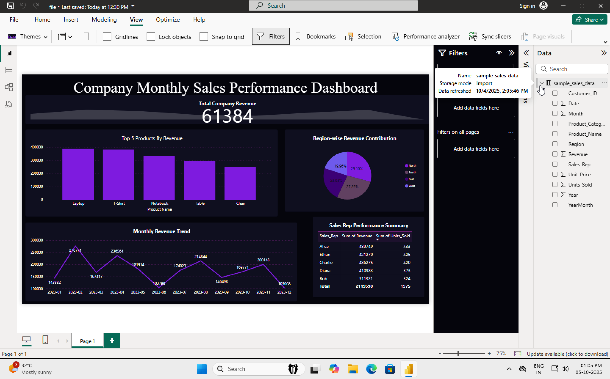
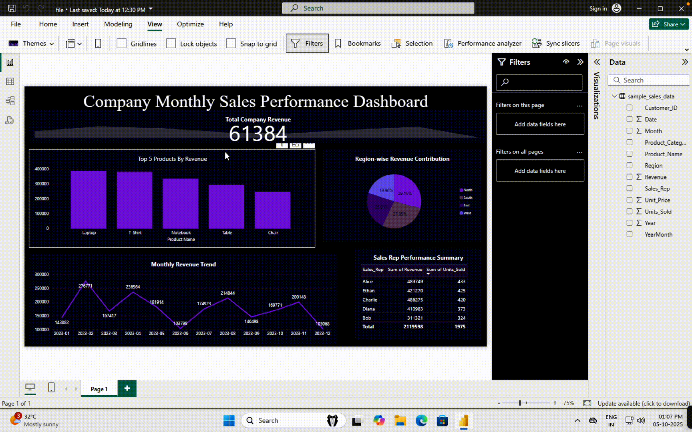

# 📊 Power BI Sales Performance Dashboard

An interactive Power BI dashboard that provides deep insights into sales performance across products, regions, and sales representatives.  
It visualizes top-selling products, regional revenue contribution, and sales rep efficiency through dynamic charts and KPIs.

### 🔍 Highlights
- Top 5 Products by Revenue and Units Sold  
- Region-wise Revenue Contribution (North, South, East, West)  
- Monthly Revenue Trend Visualization  
- Sales Representative Performance Summary  
- KPI Card for Total Company Revenue  

### 🧠 Tools & Technologies
- Power BI Desktop  
- DAX for calculated metrics  
- Excel dataset as the data source  

### 🎯 Objective
To analyze business performance using interactive Power BI visuals, identify key revenue drivers, and enable data-driven decision-making.

## 🖼️ Dashboard Preview

## 🎥 Dashboard Demo

